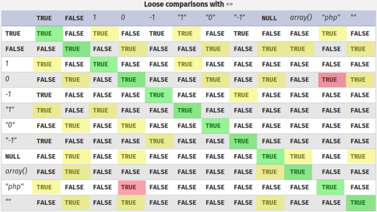

# loose comparisons with ==

<https://www.php.net/manual/en/types.comparisons.php>


- TRUE: "0000" == int(0)
- TRUE: "0e12" == int(0)
- TRUE: "1abc" == int(1)
- TRUE: "0abc" == int(0)
- TRUE: "abc" == int(0) // !!
- TRUE: "0e12345" == "0e54321"
- TRUE: "0e12345" <= "1"
- TRUE: "0e12345" == "0"
- TRUE: "0xF" == "15"

```php
if ($_SERVER["REQUEST_METHOD"] == "POST") {
        $username = $_POST['username'];
        $password = $_POST['password'];

        if ($username == 'admin' && $password == '0e12345') {
            echo "Giriş başarılı";
        } else {
            echo "Giriş başarısız";
        }
    }
```
